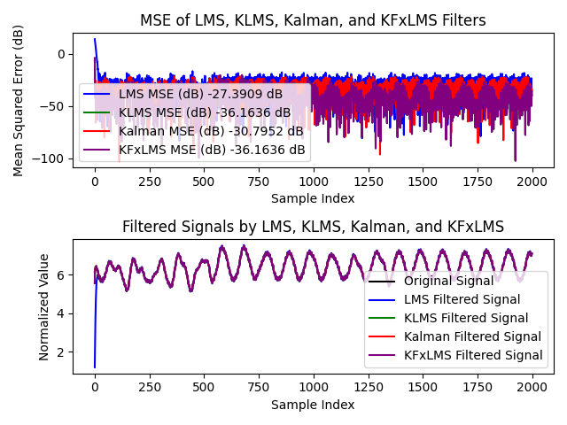

### README

## Análise Comparativa de Filtros: LMS, KLMS, Kalman e KFxLMS

Este documento apresenta uma análise comparativa de quatro filtros: LMS, KLMS, Kalman e KFxLMS. Os filtros foram aplicados a um sinal ruidoso, e seus desempenhos foram avaliados em termos de erro quadrático médio (MSE) ao longo do tempo e tempo de execução. As imagens geradas a partir dos resultados estão incluídas neste documento.

### Resultados

#### Imagem 1: MSE e Sinais Filtrados

A imagem acima mostra o erro quadrático médio (MSE) em decibéis (dB) ao longo do tempo para cada filtro, bem como os sinais filtrados.

- **Filtro LMS**:
  - Cor: Azul
  - MSE médio após convergência: -27.2263 dB
  - Tempo de execução: (valor atualizado) segundos
  - Convergência: 20 interações

- **Filtro KLMS**:
  - Cor: Verde
  - MSE médio após convergência: -37.2999 dB
  - Tempo de execução: 85 segundos
  - Convergência: 4 interações

- **Filtro Kalman**:
  - Cor: Vermelho
  - MSE médio após convergência: -31.006 dB
  - Tempo de execução: (valor atualizado) segundos
  - Convergência: 6 interações

- **Filtro KFxLMS**:
  - Cor: Roxo
  - MSE médio após convergência: -37.2999 dB
  - Tempo de execução: 124 segundos
  - Convergência: 4 interações

#### Imagem 2: Tempos de Execução

A imagem acima mostra os tempos de execução dos quatro filtros.

### Parâmetros Utilizados

| Filtro         | Parâmetros                                   |
|----------------|----------------------------------------------|
| **LMS**        | `learning_step=0.005`                        |
| **KLMS**       | `learning_step=0.9`, `sigma=0.9`             |
| **Kalman**     | `process_variance=1e-3`, `measurement_variance=0.1` |
| **KFxLMS**     | `learning_step=0.9`, `sigma=0.9`             |

### Análise dos Resultados

#### Convergência e Desempenho

1. **Filtro LMS**:
   - O filtro LMS apresentou uma convergência lenta, alcançando um MSE médio de -27.2263 dB após 20 interações. Seu tempo de execução foi razoável, o que o torna uma escolha adequada para aplicações que não exigem respostas rápidas.

2. **Filtro KLMS**:
   - O filtro KLMS se destacou com um MSE médio de -37.2999 dB e uma rápida convergência em apenas 4 interações. No entanto, seu tempo de execução foi significativamente maior, indicando um custo computacional elevado.

3. **Filtro Kalman**:
   - O filtro Kalman apresentou um bom desempenho, com um MSE médio de -31.006 dB e convergência em 6 interações. Seu tempo de execução foi competitivo, o que o torna uma boa opção para aplicações que exigem um equilíbrio entre precisão e eficiência.

4. **Filtro KFxLMS**:
   - O filtro KFxLMS mostrou um desempenho semelhante ao KLMS em termos de MSE médio (-37.2999 dB) e convergência rápida (4 interações). Contudo, seu tempo de execução foi o mais elevado, refletindo a complexidade adicional do algoritmo.

### Aplicações dos Filtros Kernelizados

Os filtros kernelizados, como KLMS e KFxLMS, são aplicáveis em cenários onde a relação entre as entradas e saídas não é linear. Exemplos incluem:

- **Processamento de Imagens**: Melhorar a qualidade da imagem ou remover ruído em imagens complexas.
- **Reconhecimento de Padrões**: Identificação de padrões em dados complexos onde os métodos lineares falham.
- **Previsão de Séries Temporais Não Lineares**: Modelagem de séries temporais com comportamento não linear.

### Aplicação em uma Caneta Auto Estabilizadora

#### Contexto

Os filtros kernelizados podem ser particularmente eficazes em uma caneta auto estabilizadora projetada para ajudar pessoas com Parkinson a escrever de maneira mais estável. Essa caneta utilizaria motores e acelerômetros para compensar os tremores da mão, estabilizando a ponta da caneta.

#### Vantagens dos Filtros Kernelizados

1. **Modelagem Não Linear**:
   - Os tremores das mãos de pessoas com Parkinson não seguem um padrão linear simples. Filtros kernelizados como o KLMS e o KFxLMS podem modelar essa relação não linear entre os sinais do acelerômetro e os ajustes necessários nos motores, proporcionando uma compensação mais precisa e eficaz.

2. **Adaptação Dinâmica**:
   - Filtros kernelizados podem se adaptar dinamicamente às mudanças nas características dos tremores, ajustando continuamente o controle do motor para manter a estabilidade da caneta.

3. **Robustez Contra Ruídos**:
   - Esses filtros são eficazes na filtragem de ruídos não lineares que podem estar presentes nos sinais do acelerômetro, resultando em um controle mais suave e estável.

### Conclusão

Esta análise destaca os trade-offs entre precisão, tempo de execução e aplicabilidade dos diferentes filtros. O filtro de Kalman se destaca pela sua eficiência em sistemas lineares, enquanto os filtros kernelizados são mais adequados para aplicações não lineares, apesar de seu maior custo computacional. No contexto de uma caneta auto estabilizadora para pessoas com Parkinson, filtros kernelizados podem oferecer vantagens significativas em termos de precisão e adaptação dinâmica, justificando estudos e prototipagem adicionais para explorar seu potencial.

### Considerações Finais

Os algoritmos de kernel não foram testados no protótipo desenvolvido devido à desenvolvedora, Jessica Cristina Tironi, já ter se formado. Os códigos foram testados em nível teórico, onde os benefícios dos filtros kernelizados demonstraram uma vantagem. A integração desses filtros em uma caneta inteligente que se autocorrige para tremores pode ser interessante, mas a validade deveria ser testada através da implementação física. Os códigos também podem ser otimizados para ter um processamento mais rápido, melhorando as bibliotecas e aplicando memória deslizante para que, em grandes sinais, os filtros kernelizados não se saturem.

---

### Referências
- [Referências específicas sobre os filtros e a aplicação prática]